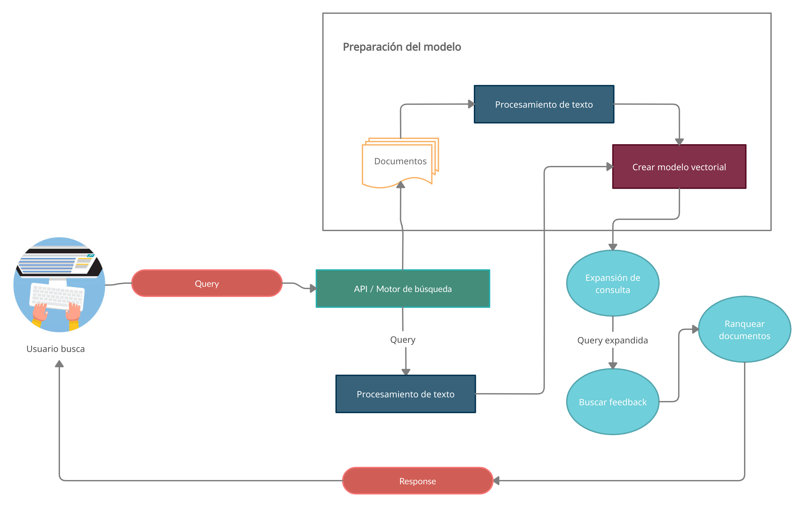

# Motor de búsqueda

## Info
El proyecto está dividido en dos aplicaciones, la interfaz gráfica (`./search_engine_interface`) desarrollada en VueJs, por la cual se realizan las consultas que se hacen a la segunda aplicación(`info_retrieval_model`) desarrollada con el framework fast api.

## Frontend / Interfaz Gráfica

### Requerimientos:
- vue
- vue-router
- yarn/npm

### Instalación

``` bash
$ cd search_engine_interface/
$ yarn install
```

### Run:

``` bash
$ cd search_engine_interface/
$ yarn serve
```


## Backend / Modelo de recuperación de la información

### Requerimientos:
- python3
- fastapi
- hypercorn
- sklearn
- numpy
- scipy
- nltk

### Run:
``` bash
$ cd info_retrieval_model/
$ hypercorn main.py --reload
```

## Esquema del flujo del motor de búsqueda:



### Preparación del modelo

Se utilizaron dos colecciones de datos [npl](http://ir.dcs.gla.ac.uk/resources/test_collections/npl/) y [LISA-collection](http://ir.dcs.gla.ac.uk/resources/test_collections/lisa/), para cada una de estas se creó una carpeta que contiene todos los documentos en archivos diferentes, para poder ser importados en la aplicación de forma fácil, con la clase **FileTools** tenemos un método para obtener el path de todos los documentos en un directorio, y un método para obtener el contenido de un archivo, de esta forma podemos cargar cada test-collection

``` python
def initialize(root_path = "."):
    # Provide the collection path
    # news-group collection
    ft = FileTools(f"{root_path}/collections/news-group")

    # docs-lisa collection
    # ft = FileTools(f"{root_path}/collections/docs-lisa")

    docs = ft.get_documents()
    return  VectorialModel(map(lambda doc: ft.read_document(doc), docs))
```

## Preprocesamiento de texto
Luego vamos a crear nuestro modelo vectorial, cada documento pasa primero por un filtro de preprocesamiento de texto, de manera tal que le aplicamos las siguientes operaciones:

- Expandimos contracciones
- Convertimos las palabras a minúscula
- Removemos los signos de puntuación
- Removemos las palabras que contengan dígitos
- Removemos las stopwords(aquellas palabras que no proveen ninguna información útil para decidir en que categoría se debe clasificar el texto. Digase: preposiciones, conjunciones, etc)
- Aplicamos lematización. Lematización es un proceso lingüístico que consiste en, dada una forma flexionada (es decir, en plural, en femenino, conjugada, etc), hallar el lema correspondiente. El lema es la forma que por convenio se acepta como representante de todas las formas flexionadas de una misma palabra. Es decir, el lema de una palabra es la palabra que nos encontraríamos como entrada en un diccionario tradicional: singular para sustantivos, masculino singular para adjetivos, infinitivo para verbos.

Luego de esto digamos que tenemos un array de cadenas, donde cada cadena le llamaremos término.

## Build del modelo vectorial
Guardamos para cada término la cantidad de documentos diferentes en los que aparece y además calculamos por cada documento la frecuencia normalizada de cada término($tf_i$).

$$ tf_i = \frac{f_i} {maxfrec} $$

``` python
def build_freq(self):
    freq = {}
    for term in self.terms:
        if(freq.__contains__(term) == False):
            freq[term] = 1
        else:
            freq[term] += 1
    self.freq = Vector(freq)

def calculate_tfi(self):
    tfi = {}
    max_freq = max(self.freq.values())

    for term in self.freq:
        tfi[term] = self.freq.vector[term] / max_freq
    self.tfi = Vector(tfi)
```

La variable $maxfrec$ corresponde a la frecuencia del término que más se repite en el documento. Esta frecuencia normalizada se realiza con el objetivo de que si un documento es igual que otro pero con los mismos términos repetidos $x$ veces no se le reste importancia al que menos frecuencia tiene, ya que los dos tendrían la misma importancia.

``` python
def __init__(self, docs):
    self.term_universe = {}
    self.docs = []
    self.feedback = Feedback()
    self.word_embedding = WordEmbedding("./core/word_embedding")
    for doc in docs:
        doc = Doc(doc)
        for term in doc.freq:
            if(self.term_universe.__contains__(term) == False):
                self.term_universe[term] = 1
            else:
                self.term_universe[term] += 1
        self.docs.append(doc)

    self.calculate_idf()
    self.calculate_weight_of_docs()
```

Ya luego pasamos a calcular la frecuencia inversa de cada término del vocabulario y con ello podemos obtener los pesos de cada término por documento.

$$idf_i = log(\frac{N}{n_i})$$
$$ w_i = tf_i * idf_i$$

Donde $N$ es la cantidad de documentos que tiene nuestro test collection y $n_i$ corresponde a la cantidad de documentos en los que aparece el $i$-ésimo término de nuestro vocabulario.

Ya tenemos nuestro modelo construido, podemos proceder a realizarle consultas

### Realizar una query:

Mediante fastapi recibimos los requests que hace nuestra interfaz de usuario:

``` python
@app.get("/query")
def query_docs(value: str = ""):
    documents = vm.query(value)
    return prepare_output(documents)
```

Donde value sería el texto de nuestra query, entonces las queries las trataremos como si fueran documentos, que quiere decir esto, todas pasarán primero por un preprocesamiento de texto donde obtenemos un array con sus términos y entonces calculamos la frecuencia normalizada para cada término, así como sus pesos($w_i$)

Como podemos ver en la clase **Doc** a la hora de calcular el peso de cada término($w_i$) hacemos una pequeña modificación a la fórmula, añadiendo un valor $A$ que permite amortiguar la contribución de la frecuencia de cada término, los valores más comunes son 0.4 y 0.5, nosotros utilizamos $A = 0.4$

$$ w_i = (A + (1 - A) * tf_i) * idf_i $$

Entonces ya que tenemos los pesos de la consulta, bastaría entonces con ranquear los documentos utilizando la fórmula de similitud del coseno:

$$ sim(d_j, q) = \frac{\sum^n w_{i,j} * w_{i,q}}{\sqrt{\sum^n w^2_{i,j}} * \sqrt{\sum^n w^2_{i,q}}} $$

Es decir para cada término del vocabulario multiplicamos los pesos en el documento $j$ y en la query.

``` python
def correlation(self, vector_a, vector_b):
    sum_t = 0
    max_vector = vector_a if len(vector_a) >= len(vector_b) else vector_b
    min_vector = vector_a if len(vector_a) < len(vector_b) else vector_b
    for term in min_vector:
        if(max_vector.__contains__(term)):
            sum_t += min_vector[term] * max_vector[term]

    if(sum_t < EPS):
        return 0
    if(vector_a.norm * vector_b.norm < EPS):
        return 100000
    return sum_t / (vector_a.norm * vector_b.norm)
```

Lo que hacemos en ese código es escoger el documento que tiene menor cantidad de términos(entre el documento $j$ y la query) así nos ahorramos costo operacional, ya que si un término no aparece en uno de los documentos la multiplicación es cero.

Al final verificamos que la multiplicación de las normas sea mayor que cero para que no se nos indefina nuestra correlación

¿Cuándo la norma de un documento puede ser cero?  
Esto solo ocurre si cada término del documento aparece en todos los demás documentos de nuestro test collection, ya que $N$ sería igual a $n_i$

Ahora que ya tenemos rankeados los documentos podemos devolverlos, pero antes vamos a ver que mejoras implementamos.

### Añadiendo feedback/retroalimentación:

En el frontend de nuestro proyecto añadimos la posibilidad de abrir cada documento, de forma tal que pueda revisarse el contenido de los documentos retornados y además la posibilidad de decir si es relevante o no. Por lo que tenemos la clase **Feedback**

La cual contiene dos métodos: `get_feedback` y `set_feedback`, entonces por cada documento que nos den feedback haciendo uso de un trie(trie es una estructura de datos para guardar cadenas, con costo lineal en tiempo con respecto al tamaño de la cadena) podemos insertar una query y en el nodo final tendremos un set con los ínidices de los documentos relevantes y otro set con los ínidices de los no relevantes, si en algún momento decimos que el documento *d* era no relevante y ahora el usuario lo clasificó como relevante en esa query entonces lo eliminamos del set de no relevantes y lo añadimos en el de relevantes, y viceversa. El uso del trie es con el objetivo de evitar hacer hash a las query, hashes que luego puedan traer coliciones y ya que podemos tener muchísimas queries en feedback, este caso es posible.

``` python
def set_feedback(self, query, feedback_type, doc_index):
    node = self.first_node
    for term in query.terms:
        if(node.mapp.__contains__(term) == False):
            node.mapp[term] = Node()
        node = node.mapp[term]

    if(feedback_type == 1):
        if(node.no_relevants.__contains__(doc_index)):
            node.no_relevants.remove(doc_index)
        node.relevants.add(doc_index)
    else:
        if(node.relevants.__contains__(doc_index)):
            node.relevants.remove(doc_index)
        node.no_relevants.add(doc_index)
```

Y ya luego para obtener el feedback es caminar por el trie, hasta llegar al final de la query en el caso de que exista y obtener los ínidices de los documentos no relevantes y relevantes.

``` python
def get_feedback(self, query):
    node = self.first_node
    for term in query.terms:
        if(node.mapp.__contains__(term) == False):
            return None
        node = node.mapp[term]

    return [node.relevants, node.no_relevants]
```

Qué podemos hacer con esto?

``` python
def get_feedback(self, query_doc):
    query_feedback = self.feedback.get_feedback(query_doc)
    if(query_feedback is None):
        return None
    relevants, no_relevants = query_feedback[0], query_feedback[1]
    qm = query_doc.wi

    sum_relev = functools.reduce(lambda a, b: a + self.docs[b].wi, relevants, Vector())
    sum_no_relev = functools.reduce(lambda a, b: a + self.docs[b].wi, no_relevants, Vector())

    b = 0 if len(relevants) == 0 else 0.75 / len(relevants)
    y = 0 if len(no_relevants) == 0 else 0.15 / len(no_relevants)
    qm = qm + (sum_relev * b) - (sum_no_relev * y)
    qm.calculate_norm()
        return qm
```

Pues creamos una nueva query, llamémosle $q_m$ y quedaría de la siguiente forma:

$$ q_m = q + \beta * d_r - \gamma * d_{nr} $$

Es decir tendremos nuevos pesos en los términos, sumamos los pesos de nuestra query base($q$) y luego por cada documento relevante sumamos el peso de cada término multiplicado por $\beta$, y por cada documento no relevante restamos el peso de cada término multiplicado por $\gamma$, los valores de $\beta$ y $\gamma$ que se utilizaron fueron $0.75$ y $0.15$ respectivamente.

El algoritmo en resumen lo que hace es darle mayor importancia a los términos más usados en los documentos considerados relevantes para los usuarios, y por el contrario, los términos más usados en los documentos no relevantes se les da menor importancia.

Con este nuevo vector de pesos en nuestra query podemos ranquear los documentos y retornarlos, pero antes veamos como añadimos expansión de consultas.

### Expansión de consulta:
Hasta ahora solo trabajamos con los términos de nuestro vocabulario, pero que pasa cuando el documento que buscamos no contiene los términos de nuestra query, porque resulta que son similares, ya sea porque son sinónimos o familias de palabras.

Aquí es donde las word embbeddings juegan un papel importante.
Qué es word embeedings?
No es más que un conjunto de modelos de lenguaje y técnicas de aprendizaje en procesamiento del lenguaje natural en dónde las palabras o frases del lenguaje natural son representadas como vectores de números reales.

Al tener representada las palabras como vectores podemos saber que tan similares son dos palabras.

Entonces en nuestro proyecto, utilizamos un modelo pre-entrenado de [glove](https://nlp.stanford.edu/projects/glove/), específicamente el `glove.6B` el cual contiene 400 mil términos, representados en vectores de 50, 100, 200 y 300 dimensiones.

Al momento de obtener una query, por cada término de *q* que aparezca en las word embeddings de glove buscamos el término más similar, como hacemos esto, para cada término de glove, hallamos la distancia euclideana entre este y el word embedding de *q*, y nos quedamos con el de menor distancia.

Esto tiene una complejidad temporal de $O(N)$ (esto obviando el costo de hallar la distancia euclideana entre dos puntos), cosa que estaríamos haciendo por cada término, algo lento si nuestra query tiene muchos términos diferentes.

Pero aquí entra [KDTree](https://es.wikipedia.org/wiki/%C3%81rbol_kd), es una estructura de datos de particionado del espacio que organiza los puntos en un Espacio euclídeo de k dimensiones. Entonces al cargar las word embeddings de glove creamos nuestro kdtree, y ya luego solo sería realizar las consultas.

``` python
def find_similar_word_kdtree(self, embedes, count = 2):
    _, nearests = self.kd_tree.query([embedes], k = count)
    return [self.keys[nearests[0][1]]]
```

Utilizamos el KDTree ya implementado en *sklearn*. Citando la documentación:  
*"KD tree query time changes with D in a way that is difficult to precisely characterise. For small D (less than 20 or so) the cost is approximately O(D log N), and the KD tree query can be very efficient. For larger D, the cost increases to nearly O(D * N), and the overhead due to the tree structure can lead to queries which are slower than brute force."*

Traducción:
El tiempo de consulta del KD-tree cambia con respecto a **D** de una manera que es difícil de caracterizar con precisión. Para **D** pequeños (menos de 20 aproximadamente) el costo es de aproximadamente **O(D log N)**, y la consulta del KD-tree puede ser muy eficiente. Para **D** más grande, el costo aumenta a casi **O(D * N)**, y la sobrecarga debido a la estructura de árbol puede generar consultas que son más lentas que la fuerza bruta.

Sin embargo en todos los casos que se probaron funcionó mucho más rápido que la fuerza bruta, en este proyecto utilizamos vectores de 300 dimensiones.

Ya tenemos para cada término de nuestra query la word embedding más similar, para identificar los términos de la expansión creamos un vector basado en estos word embeddings, un enfoque llamado average word embeddings (AWE), el cual le da el mismo peso a cada término de la query:

$$AWE(q) = \frac{1}{n} \sum_{w_i \in q} \vec{w_i}$$

Donde $\vec{w_i}$ corresponde al word embedding del término $wi$ que pertenece a la query, y $n$ es el número de términos diferentes que tiene la query $q$.

Kuzi et al, propone el uso de closest term, el cual se mide por similitud del coseno entre nuestro vector AWE y el word embedding candidato a término de expansión. Los autores definen la función de puntación de esta forma:

$$ S(w, q) = exp^{\displaystyle{cos(\vec{w}, AWE(q))}} $$

Donde $\vec{w}$ sería el word embedding correspondiente al término $w$

Vamos a extender la fórmula AWE usando una estrategia basada en datos para combinar las word embeddings. La representación de nuestro vector IDF-AWE, es una representación de nuestra query generada por la combinación lineal de nuestros términos correspondientes a las word embeddings con sus IDF:

$$ IDF-AWE(q) = \frac{1}{\sum_{w_i \in q} IDF(w_i)} * \sum_{w_i \in q} IDF(w_i) * \vec{w_i}$$

Donde el IDF está calculado con respecto al vocabulario, IDF-AWE dará más importancia a términos de *q* que son más específicos en el vocabulario. Para mantener la magnitud de los word embeddings, la suma de los vectores is multilicada por la suma de los IDF de los términos que pertenecen a la query, de esta forma el vector IDF-AWE toma la misma magnitud que los words embeddings.

``` python
# IDF-AWE(q) = ( 1 / sum (IDF(wordi) ) ) * sum( IDF(wordi) * wordi_vector )
# wordi is the word embedding of qi term of the query
def get_idf_awe(self, wordi_array):
    AWE_vector = np.zeros(self.word_embedding.vector_dimension, dtype=float)
    sum_IDF = 0
    embed_dict = self.word_embedding.embed_dict
    for val in wordi_array:
        sum_IDF +=  self.get_word_idf(val[1])
        AWE_vector += embed_dict[val[0]] * self.get_word_idf(val[1])

    return AWE_vector * ( 1 / sum_IDF )

def get_query_expansion(self, query_doc):
    wordi_array = []
    embed_dict = self.word_embedding.embed_dict
    for term in query_doc.terms:
        # word embeddings related with qi term
        if(embed_dict.__contains__(term)):
            wordi_array = wordi_array + [[self.word_embedding.find_similar_word_kdtree(embed_dict[term])[0], term]]
    idf_awe_vector = self.get_idf_awe(wordi_array)
    wordi_ranking = list(map(lambda val: [np.exp(spatial.distance.cosine(embed_dict[val[0]], idf_awe_vector)), val[0]], wordi_array))
    return list(map(lambda x: x[0], sorted(wordi_ranking, reverse=True)))
```

Entonces ya teniendo nuestro vector IDF-AWE y apoyándonos en la fórmula de similitud de arriba, nos quedamos con los 10 primeros word embeddings. Y los añadimos a nuestra query como términos de expansión y ahora si obtenemos feedback, calculamos los pesos nuevamente, y ranqueamos los documentos.

## Pruebas y Métricas

Se hicieron pruebas con dos colecciones de datos done se utilizaron 4 medidas para evaluar el comportamiento de nuestro sistema de recuperación de la información, las medidas que se utilizaron fueron: 
- Precisión: la relación entre los documentos recuperados que son relevantes y el total de documentos recuperados.
- Recobrado: la relación entre los documentos relevantes recuperados y el total de documentos relevantes.
- Medida F: hace ilusión a la relación entre la precisión y el recobrado.
- Medida F1: muestra la relación entre la precisión y recobrado, es un caso particular de la Medida F, pero con $\beta = 1$.

Para los dos conjuntos de pruebas que usamos, promediamos los valores de cada una de las métricas obtenidos en cada consulta, y además utilizamos $\beta = 0.5$ para la medida F, ya que le dimos mayor peso al recobrado de documentos.

1- Lisa docs: contiene un total de 6004 documentos, y se corrieron las 33 pruebas de esta colección, se retornaba siempre una cantidad fija de documentos, en este caso 20:

Precisión: $0.15303030$  
Recobrado: $0.42850178$  
Medida F: $0.16423873$  
Medida F1: $0.19284608$  

2- Npl docs: contiene un total de 11429 documentos, y se corrieron las 93 pruebas de esta colección, en este caso se filtraba para que los documentos retornados tuvieran una similitud mayor a 0.15, y como máximo se retornaban 40 documentos:

Precisión: $0.15674785$  
Recobrado: $0.28807682$  
Medida F: $0.15973845$  
Medida F1: $0.17276212$  

Como se puede ver siempre el recobrado tiene mayor puntuaje que la precisión y esto es debido a que se le dió más fuerza a la hora de retornar los documentos, no obstante los resultados obtenidos son muy buenos

## Análisis crítico

Entre las ventajas del modelo que implementamos, podemos decir que es bastante rápido a la hora de procesar un gran volumen de documentos, además de que se basa en las métricas TF-IDF para darle peso a los términos de los documentos.  
Pero no todo es bueno, algo que tiene el modelo vectorial es que cuando haces una query para recuperar un documento tiene que tener al menos un término en común con el documento, de lo contrario la similitud por coseno será igual a cero, este problema le dimos solución usando las word embeddings, las cuales nos permiten encontrar términos similares que quizás no estaban en la query.  
Otra desventaja es que si queremos añadir documentos en tiempo de ejecución, tendremos que recalcular el modelo completamente, algo que nos costaría un poco de tiempo.  
Es decir, este modelo está hecho para motores de búsquedas estáticos, o poco mutantes.

## Posibles mejoras
Entre las posibles mejoras para trabajos futuros está usar el modelo pre-entrenado de tensorflow ELMO(Embeddings from Language Model), el cual es un modelo para representar una secuencia de palabras como una sequencia de vectores y lo podemos utilizar para dado un texto obtener una palabra que se relacione con el contexto, algo así como sacar la idea central, lo que se conoce como CBOW(Continuos Bag of Words).

Quizás implementar el modelo probabilístico :)

Galería


[Link Video](https://www.loom.com/share/6d941e0b0c7c4f3dafd77a9e0d6cf4fa)